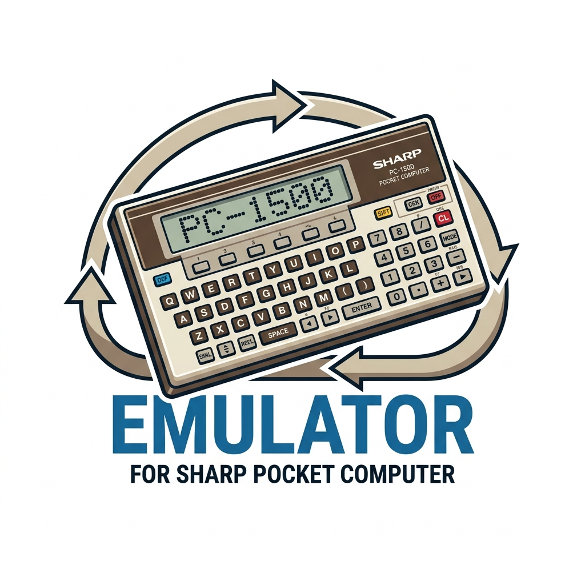

<p align="center">
  
</p>

# Sharp PC-1500 Emulator

A Sharp PC-1500 / PC-1500A pocket computer emulator built with Flutter for macOS.

## Features

- Full LH5801 CPU emulation at 1.3 MHz
- Accurate LCD display (156x7 pixels) with symbol indicators
- On-screen keyboard with authentic skin
- Physical keyboard support
- Sound emulation (buzzer)
- Screenshot capture (toolbar button)
- PC-1500 and PC-1500A hardware variants
- BASIC programming environment

## Keyboard Shortcuts

| Key | Function |
|-----|----------|
| A-Z, 0-9 | Alphanumeric input |
| Enter | ENTER |
| Space | SPACE |
| Arrow keys | Navigation |
| Backspace / Delete | CL (Clear) |
| Escape | ON |
| F1-F6 | Function keys |

## Building

```bash
flutter pub get
flutter run -d macos
```

## Requirements

- Flutter SDK >= 3.10.0
- macOS 10.15+
- Xcode

## Architecture

The emulator runs the LH5801 CPU in a separate Dart isolate for consistent timing. The display and keyboard communicate with the emulator via message passing.

| Package | Description |
|---------|-------------|
| `device` | Emulator core: CPU, keyboard, LCD, and isolate management |
| `lcd` | LCD event model and display buffer decoding |
| `packages/lh5801` | LH5801 CPU emulator |
| `packages/lh5811` | LH5811 I/O port controller |

## License

See [LICENSE](LICENSE) for details.
